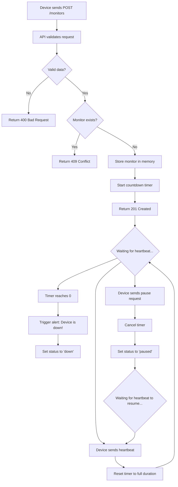

# Pulse-Check API - Watchdog Sentinel System

A Dead Man's Switch API for monitoring remote devices (solar farms, weather stations) in areas with poor connectivity. Automatically detects when devices go offline and triggers alerts.

## ARCHITECTURE

### SYSTEM FLOW DIAGRAM



### HOW IT WORKS

1. **Registration**: Devices register with a unique ID and timeout duration
2. **Timer Creation**: A background thread starts counting down
3. **Heartbeat Reset**: Each heartbeat resets the countdown to full duration
4. **Alert Trigger**: If countdown reaches zero (no heartbeat), system logs alert
5. **State Management**: Monitors can be active, down, or paused

### TECHNICAL DESIGN DECISIONS

- **In-Memory Storage**: Uses Python dictionary for monitor state (no database needed)
- **Threading Model**: Python's `threading.Timer` for independent countdown timers
- **Thread Safety**: `Lock` mechanism prevents race conditions
- **RESTful Design**: Standard HTTP methods and status codes

---

##  SETUP INSTRUCTIONS

### PREREQUISITES

- Python 3.8 or higher
- pip (Python package manager)

### INSTALLATION

1. **Clone the repository**
   ```bash
   git clone <your-repo-url>
   cd pulse-check-api
   ```

2. **Create a virtual environment**
   ```bash
   python -m venv venv
   source venv/bin/activate        # macOS/Linux
   venv\Scripts\activate           # Windows
   ```

3. **Install dependencies(installs Flask and all required packages)** 
   ```bash
   pip install -r requirements.txt
   ```

4. **Run the server**
   ```bash
   python app.py
   ```

4. **Verify it's running**
   ```bash
   curl http://localhost:5000/health
   ```

You should see:
```json
{
  "status": "healthy",
  "service": "Pulse-Check API",
  "timestamp": "2024-02-13T..."
}
```

---

##  API DOCUMENTATION

### BASE URL
```
http://localhost:5000
```

### ENDPOINTS

#### 1. CREATE MONITOR (REGISTER DEVICE)

**Endpoint:** `POST /monitors`

**Description:** Register a new device for monitoring

**Request Body:**
```json
{
  "id": "device-123",
  "timeout": 60,
  "alert_email": "admin@critmon.com"
}
```

**Response:** `201 Created`
```json
{
  "message": "Monitor device-123 created successfully",
  "monitor": {
    "id": "device-123",
    "timeout": 60,
    "status": "active"
  }
}
```

**Example:**
```bash
curl -X POST http://localhost:5000/monitors \
  -H "Content-Type: application/json" \
  -d '{
    "id": "solar-farm-01",
    "timeout": 60,
    "alert_email": "ops@critmon.com"
  }'
```

---

#### 2. SEND HEARTBEAT (RESET TIMER)

**Endpoint:** `POST /monitors/{id}/heartbeat`

**Description:** Device sends "I'm alive" signal to reset countdown

**Response:** `200 OK`
```json
{
  "message": "Heartbeat received for device-123",
  "status": "timer_reset",
  "next_expiry": 60
}
```

**Example:**
```bash
curl -X POST http://localhost:5000/monitors/solar-farm-01/heartbeat
```

**Error Response:** `404 Not Found` (if monitor doesn't exist)

---

#### 3. PAUSE MONITOR (BONUS FEATURE)

**Endpoint:** `POST /monitors/{id}/pause`

**Description:** Pause monitoring (e.g., during maintenance)

**Response:** `200 OK`
```json
{
  "message": "Monitor device-123 paused",
  "status": "paused"
}
```

**Example:**
```bash
curl -X POST http://localhost:5000/monitors/solar-farm-01/pause
```

**Note:** Sending a heartbeat will automatically resume a paused monitor

---

#### 4. LIST ALL MONITORS (DEVELOPER'S CHOICE)

**Endpoint:** `GET /monitors`

**Description:** View all monitors and their status

**Response:** `200 OK`
```json
{
  "monitors": [
    {
      "id": "solar-farm-01",
      "timeout": 60,
      "status": "active",
      "alert_email": "ops@critmon.com",
      "last_heartbeat": "2024-02-13T14:30:00",
      "created_at": "2024-02-13T14:00:00"
    }
  ],
  "total": 1
}
```

**Example:**
```bash
curl http://localhost:5000/monitors
```

---

#### 5. GET MONITOR DETAILS (DEVELOPER'S CHOICE)

**Endpoint:** `GET /monitors/{id}`

**Description:** Get detailed status of a specific monitor

**Response:** `200 OK`
```json
{
  "id": "solar-farm-01",
  "timeout": 60,
  "status": "active",
  "alert_email": "ops@critmon.com",
  "last_heartbeat": "2024-02-13T14:30:00",
  "created_at": "2024-02-13T14:00:00"
}
```
**Example:**
```bash
curl http://localhost:5000/monitors/solar-farm-01
``` 

---

#### 6. DELETE MONITOR (DEVELOPER'S CHOICE)

**Endpoint:** `DELETE /monitors/{id}`

**Description:** Remove a monitor (e.g., device decommissioned)

**Response:** `200 OK`
```json
{
  "message": "Monitor solar-farm-01 deleted successfully"
}
```

**Example:**
```bash
curl -X DELETE http://localhost:5000/monitors/solar-farm-01
```

---

### ALERT SYSTEM

When a timer expires (no heartbeat received within timeout period), the system triggers an alert:

**Console Output:**
```
============================================================
{
  "ALERT": "Device solar-farm-01 is down!",
  "time": "2024-02-13T14:31:00.123456",
  "device_id": "solar-farm-01",
  "alert_email": "ops@critmon.com"
}
============================================================
```

The monitor status changes to `"down"`.

---

## DEVELOPER'S CHOICE FEATURE

### What I Added: **Complete CRUD Operations + Health Check**

**Why:**
1. **GET /monitors** - Operators need to see all devices at a glance (dashboard view)
2. **GET /monitors/{id}** - Detailed status checking for specific devices
3. **DELETE /monitors/{id}** - Clean up decommissioned devices
4. **GET /health** - Infrastructure monitoring (load balancers, uptime checks)

**Real-World Value:**
- **Operational Visibility**: Support teams can quickly scan all monitored devices
- **Debugging**: Check exact status without trial-and-error
- **Lifecycle Management**: Properly decommission devices instead of leaving orphaned monitors
- **Production Readiness**: Health checks are standard for production APIs

---

## TESTING GUIDE

### Manual Testing Flow

1. **Create a monitor with short timeout (10 seconds for testing)**
   ```bash
   curl -X POST http://localhost:5000/monitors \
     -H "Content-Type: application/json" \
     -d '{"id": "test-device", "timeout": 10, "alert_email": "test@example.com"}'
   ```

2. **Wait 5 seconds, send heartbeat**
   ```bash
   curl -X POST http://localhost:5000/monitors/test-device/heartbeat
   ```
   Timer should reset to 10 seconds.

3. **Wait 10+ seconds without heartbeat**
   Watch the console - you should see the alert trigger!

4. **Check monitor status**
   ```bash
   curl http://localhost:5000/monitors/test-device
   ```
   Status should be `"down"`.

5. **Send heartbeat to revive**
   ```bash
   curl -X POST http://localhost:5000/monitors/test-device/heartbeat
   ```
   Status should change to `"active"` and timer restarts.

6. **Test pause feature**
   ```bash
   curl -X POST http://localhost:5000/monitors/test-device/pause
   ```
   Wait 10+ seconds - no alert should fire.

---

## THREAD SAFETY

The application uses Python's `threading.Lock` to ensure:
- Multiple devices can send heartbeats simultaneously
- Timer creation/cancellation is atomic
- No race conditions when accessing monitor state

---

## MONITOR STATES

| State    | Description                                    | Can Heartbeat? |
|----------|------------------------------------------------|----------------|
| `active` | Timer is running, device is monitored          | Yes (resets timer) |
| `down`   | Timer expired, alert was triggered             | Yes (revives device) |
| `paused` | Monitoring paused (maintenance mode)           | Yes (resumes monitoring) |

---

## TECHNOLOGY STACK

- **Python 3.8+**: Core language
- **Flask**: Web framework for REST API
- **threading.Timer**: Background countdown timers
- **threading.Lock**: Thread synchronization

---

## PROJECT STRUCTURE

```
pulse-check-api/
├── app.py                    # Main application
├── requirements.txt          # Dependencies
├── README.md                 # This file
└── architecture-diagram.mermaid  # System design
```

---

## PRODUCTION CONSIDERATIONS

For production deployment, you would need to add:

1. **Persistent Storage**: Database (PostgreSQL, Redis) to survive restarts
2. **Real Alerts**: Email/SMS/Webhook integration instead of console logs
3. **Authentication**: API keys or OAuth for security
4. **Rate Limiting**: Prevent abuse
5. **Monitoring**: Prometheus metrics, logging
6. **Horizontal Scaling**: Redis for distributed timer state

---

## AUTHOR

Built as part of the CritMon Servers Inc. technical assessment.

---

## LICENSE

MIT
